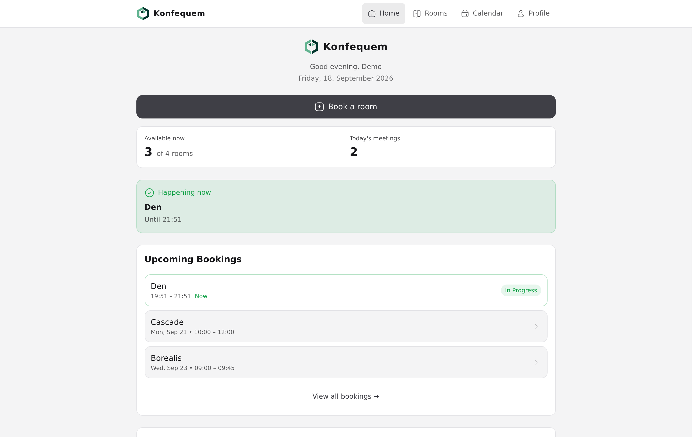
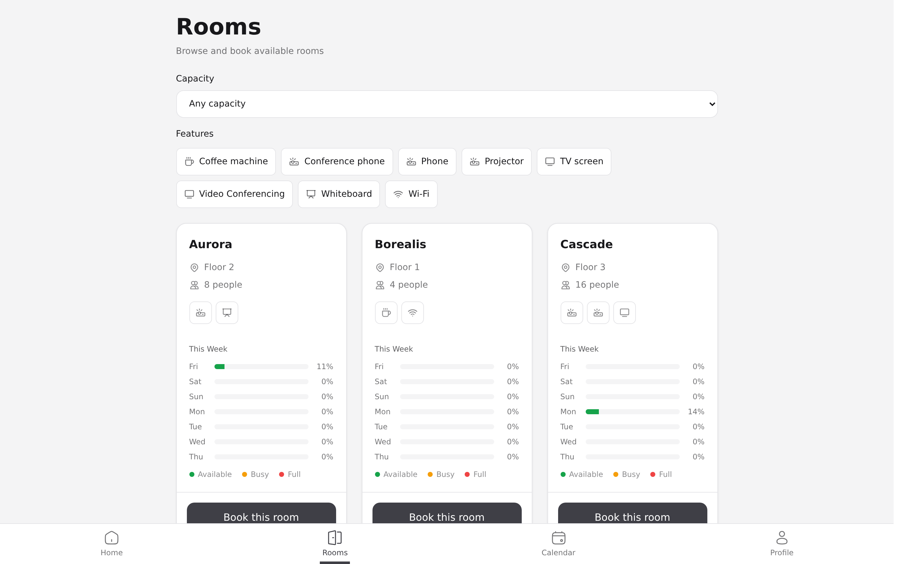
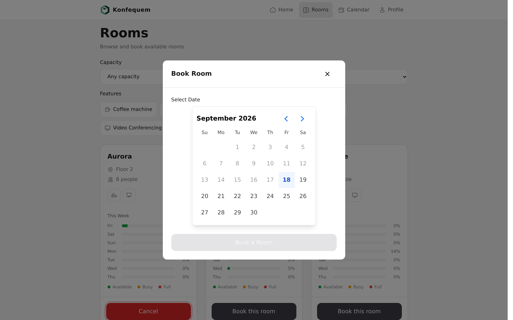
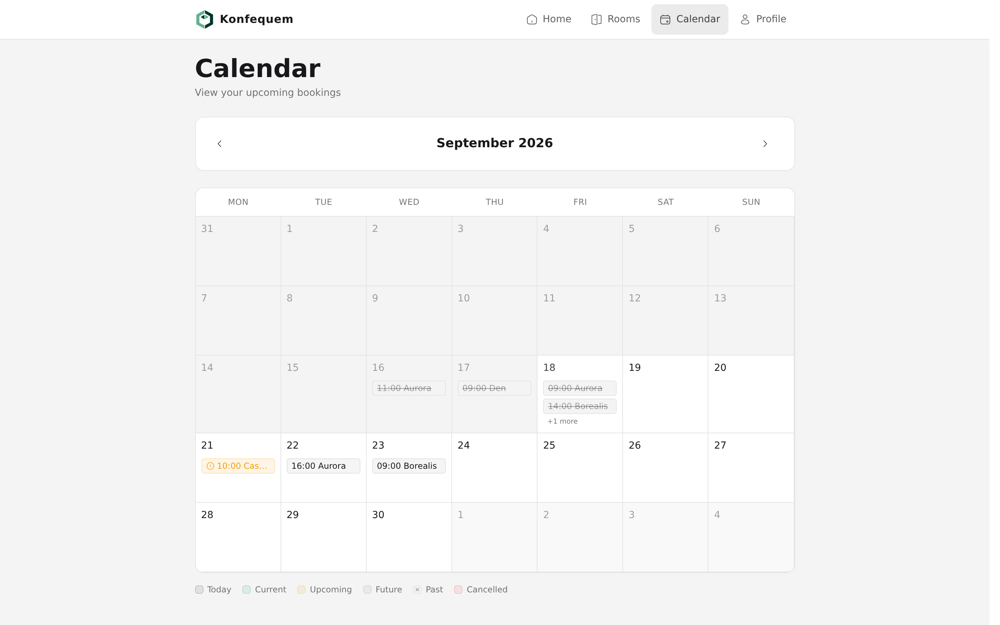
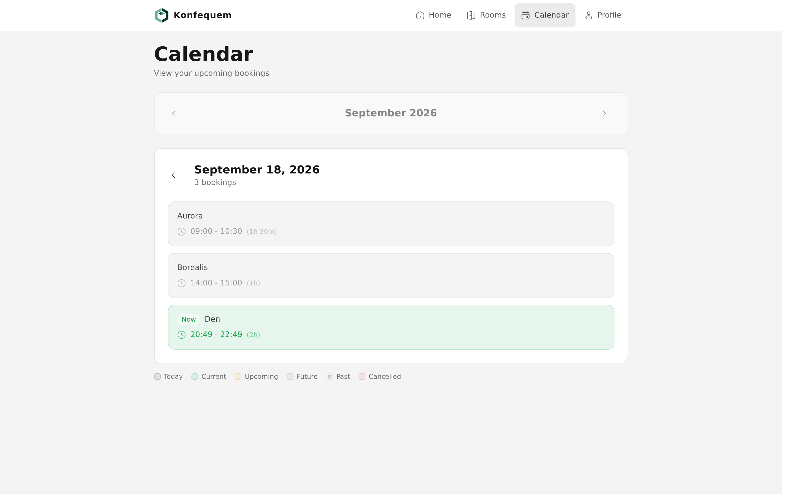
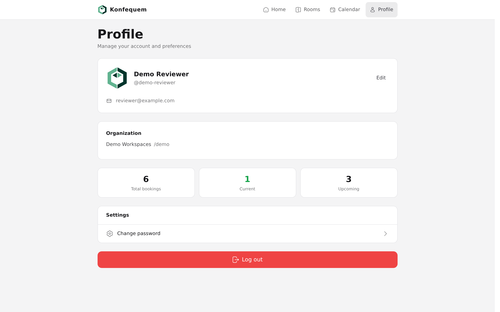

<div align="center">

# Konfequem

### Multi-Tenant Room Booking Platform

[](https://typescriptlang.org)
[](https://react.dev)
[](https://djangoproject.com)
[](https://postgresql.org)
[](https://docker.com)

*Book rooms by the hour with an interactive availability calendar, JWT-secured API, and office-hours validation.*

</div>

---

## Live Demo

**[konfequem.netlify.app](https://konfequem.netlify.app)**


| Demo access | |
|---|---|
| Login | `demo-reviewer` |
| Password | `DemoOnly-Br4nd-New-2026` |

The account comes preloaded with sample rooms and bookings (member role, no
admin rights). Demo-only — please don't enter real data. Demo content is
reset periodically.



| Rooms | Booking |
|---|---|
|  |  |
|  |  |



## What it does

Konfequem is a room booking system for organizations that need to manage shared spaces — conference rooms, coworking desks, studios. Users browse available rooms, pick a time slot on a visual calendar, and book instantly. The backend enforces business rules: no double-bookings, office hours only (08:00–22:00), min 15 min / max 8 hours per booking.

## Key Features

- **Visual Calendar** — Interactive calendar view for room availability at a glance
- **Room Management** — Browse rooms, view details, filter by capacity and equipment
- **JWT Authentication** — Secure signup/login with access + refresh tokens (SimpleJWT)
- **Booking Validation** — Office hours enforcement, overlap detection, advance booking limits
- **User Profiles** — Account management and booking history
- **Timezone-Aware** — Stores UTC, displays Europe/Berlin; correct DST handling
- **Docker-Ready** — Full Docker Compose stack (Django + React + PostgreSQL)
- **Test Suite** — 241 pytest tests on the backend, Vitest + MSW on the frontend, Playwright E2E over the full booking flow

## Engineering Highlights

- **Strict multi-tenancy** — every query is organization-scoped; DB-level
  guard triggers (plus model validation) prevent moving rooms/users across
  orgs while bookings reference them, even for writers that bypass the API.
- **One source of truth for booking rules** — office hours, duration and
  advance limits live in a single validator module shared by the DRF
  serializer *and* `Model.clean()`, so the API and Django admin can't drift.
- **Soft-cancel with parity** — cancelled bookings stay as history, are
  excluded from overlap checks in the serializer *and* in the partial DB
  exclusion constraint; the slot frees up, the audit trail stays.
- **Token hygiene** — changing a password blacklists *all* outstanding
  refresh tokens, so a stolen refresh token dies immediately.
- **DST-safe time handling** — everything stores UTC, renders in
  Europe/Berlin; tests use timezone fixtures instead of hardcoded offsets.
- **Deliberate rate limiting** — throttles are scoped per auth-sensitive
  endpoint only; data endpoints stay unthrottled so tab navigation can't
  exhaust a global budget.

## Architecture

```
konfequem/
├── backend/                  # Django 4.2 REST API
│   ├── config/               # Project settings, URLs, ASGI/WSGI
│   ├── rooms/                # Core app: models, views, serializers
│   │   ├── models.py         # Room & Booking models
│   │   ├── models_users.py   # Custom user model
│   │   ├── auth_serializers.py
│   │   └── management/       # Custom management commands
│   ├── admin-interface/      # Django admin customizations
│   ├── tests/                # pytest test suite
│   └── Dockerfile
├── frontend/                 # React 19 + Vite + TypeScript
│   └── src/
│       ├── pages/            # Calendar, Rooms, Home, Profile
│       ├── components/       # Reusable UI components
│       ├── context/          # React context providers
│       └── utils/            # Helpers and API clients
├── docker-compose.yml
└── .github/                  # CI/CD workflows
```

## Tech Stack

| Layer | Technology |
|-------|-----------|
| Frontend | React 19, TypeScript, Vite |
| Backend | Django 4.2, Django REST Framework |
| Auth | SimpleJWT (access + refresh tokens) |
| Database | PostgreSQL (required — dev via Docker Compose) |
| Infra | Docker, Docker Compose |
| Testing | pytest (backend), Vitest + MSW (frontend) |

## Getting Started

```bash
# Prerequisites: Docker & Docker Compose

# Clone
git clone https://github.com/moriarthur/konfequem.git
cd Konfequem

# Configure
cp .env.docker.example .env

# Start all services
docker compose up -d

# Run migrations & create admin
docker compose exec backend python manage.py migrate
docker compose exec backend python manage.py createsuperuser

# Access
# Frontend:  http://localhost:5173
# API:       http://localhost:8000/api
# Admin:     http://localhost:8000/admin
```

## Booking Rules

| Rule | Value |
|------|-------|
| Operating hours | 08:00 – 22:00 (Berlin time) |
| Minimum booking | 15 minutes |
| Maximum booking | 8 hours |
| Advance booking | Up to 90 days |
| Overlap detection | Server-side validation |

## Testing

```bash
# Backend — pytest (241 tests)
cd backend && python3 -m pytest --tb=short -q

# Frontend — Vitest + MSW component tests
cd frontend && npx vitest run

# Browser E2E — full booking flow via Playwright
# (requires the Docker Compose stack running: docker compose up -d)
cd frontend && npm run e2e
```

The E2E test is self-contained: it registers its own throwaway organization,
creates a room, books a slot, and asserts the booking shows up on the
calendar — no seeded data required. It is run locally, not (yet) in CI.

---

<div align="center">

*Built with [Claude Code](https://claude.ai/code) — AI-native development workflow*

</div>
